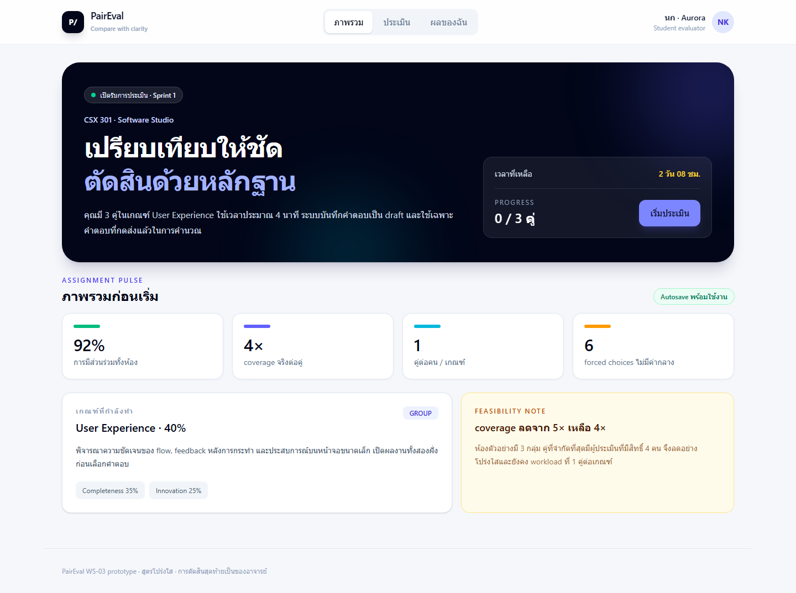

# PairEval

ระบบประเมินผลงานนักศึกษาแบบ **Pairwise Comparison** สำหรับรายวิชาในมหาวิทยาลัย ผู้ประเมินเลือกจากตัวเลือกบังคับ 6 ระดับว่า item ฝั่งใดดีกว่า ระบบจึงคำนวณคะแนนที่อธิบายและตรวจสอบย้อนกลับได้ โดยอาจารย์ยังเป็นผู้ตัดสินและ finalize คะแนนเสมอ

โปรเจกต์นี้รีแฟกเตอร์ตาม PRD `PairEval v2.0` และ workshop WS-01 ถึง WS-03 โดยโฟกัสที่ **M1 Walking Skeleton** และ test harness ของ Pairing/Scoring Engine



## ฟีเจอร์ในขอบเขตปัจจุบัน

- หน้า responsive สำหรับดู assignment, ทำ pairwise evaluation และดูผลชั่วคราว
- 6-point forced choice พร้อม accessible labels และ progress
- Pairing feasibility และ deterministic pair generation ตาม seed
- Pure scoring functions: quality index, band mapping, criterion weights และ participation multiplier
- FastAPI walking-skeleton endpoints สำหรับ publish, evaluation draft/submit และ score preview
- OpenAPI contract, architecture/ER diagrams, backlog และ unit briefs ที่ trace หากันได้
- Unit tests ด้วย fake repository, factories และ fixtures พร้อม Playwright smoke test

Google OIDC, PostgreSQL persistence, audit storage และ production deployment ยังเป็นงานหลัง WS-03; demo backend ใช้ in-memory state โดยไม่มี production seed/reset endpoint

## เริ่มใช้งาน

### Backend

```powershell
python -m pip install -r requirements.txt
cd backend
python -m uvicorn main:app --reload
```

API docs: `http://localhost:8000/docs`

### Frontend

```powershell
cd frontend
npm ci
npm run dev
```

เปิด `http://localhost:5173`

## ตรวจสอบคุณภาพ

```powershell
cd backend
python -m pytest -q

cd ../frontend
npm test
npm run lint
npm run build
npm run test:e2e
```

ดูรายละเอียดบริบทที่ [`memory-bank/intent.md`](memory-bank/intent.md), backlog ที่ [`docs/backlog.md`](docs/backlog.md) และ API contract ที่ [`docs/openapi.yaml`](docs/openapi.yaml)
