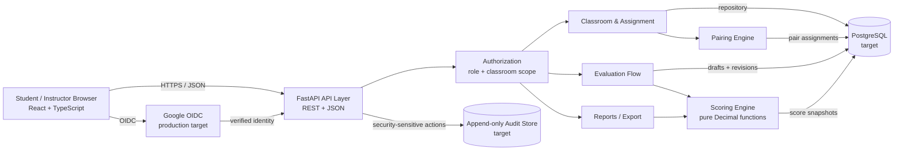

# PairEval Architecture

## Boundaries

- FastAPI/Pydantic validates transport data; domain services never depend on HTTP objects.
- Pairing and scoring depend on repository interfaces or value objects, so WS-03 tests use in-memory fakes without a database.
- Scoring is deterministic and stateless. Final persistence stores both inputs and outputs so later formula changes remain auditable.
- Production identity and evaluator-identity reads pass through one authorization layer. The WS-03 demo mode is explicitly non-production.

## Protocols

- Browser ↔ API: HTTPS, REST, JSON; autosave uses idempotent `PUT`.
- Browser ↔ Auth: Google OAuth 2.0 / OIDC in production.
- Services ↔ PostgreSQL: parameterized repository queries in the target adapter.
- API → Audit store: append-only security events; no update/delete API.
