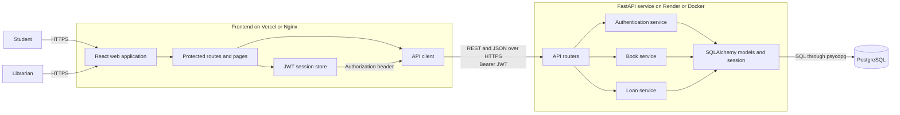

# UniLib Architecture (WS2)

แผนภาพนี้เป็น component diagram หลักของระบบ และใช้ชื่อส่วนประกอบให้ตรงกับโค้ดปัจจุบัน

## Data flow ที่ควรรู้ตอนนำเสนอ

1. ผู้ใช้ Login ผ่าน React แล้ว FastAPI ตรวจ password hash และออก JWT อายุ 12 ชั่วโมง
2. Frontend ส่ง JWT ใน `Authorization: Bearer ...` ทุก protected request
3. Router ตรวจ request และ role ก่อนส่งงานให้ service ซึ่งเป็นเจ้าของ business rules
4. Service อ่านหรือแก้ข้อมูลผ่าน SQLAlchemy และ PostgreSQL
5. การยืมล็อกแถวหนังสือใน transaction เพื่อไม่ให้หนังสือรายการเดียวถูกยืมพร้อมกัน
6. การลบหนังสือเป็น soft delete เพื่อซ่อนจาก catalog โดยไม่ทำลายประวัติการยืม

Production ใช้ Vercel สำหรับ frontend และ Render สำหรับ FastAPI/PostgreSQL ส่วน test-only reset route จะถูก register เฉพาะ `APP_ENV=test` และต้องมี `X-E2E-Seed-Token`
