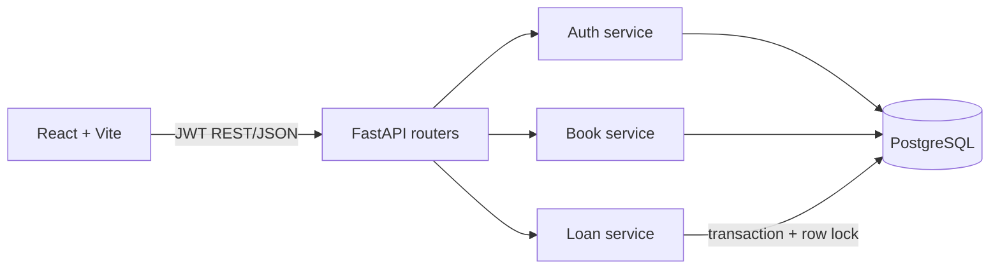

# UniLib Architecture

Frontend routes are protected by the current user role, while every permission is checked again by FastAPI. Routers validate requests and map HTTP responses; services own business rules; SQLAlchemy models and sessions own persistence. JWT access tokens expire after 12 hours. Passwords are stored only as Argon2 hashes.

Production uses Vercel for the frontend and Render for the API/PostgreSQL. The `develop` branch is the staging auto-deploy branch. The E2E reset route is registered only when `APP_ENV=test` and requires `X-E2E-Seed-Token`.
