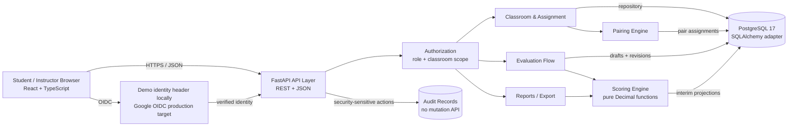

# PairEval Architecture

```mermaid
flowchart LR
    Browser["Student / Instructor Browser\nReact + TypeScript"]
    Auth["Demo identity header locally\nGoogle OIDC production target"]
    API["FastAPI API Layer\nREST + JSON"]
    Authz["Authorization\nrole + classroom scope"]
    Classroom["Classroom & Assignment"]
    Pairing["Pairing Engine"]
    Evaluation["Evaluation Flow"]
    Scoring["Scoring Engine\npure Decimal functions"]
    Reports["Reports / Export"]
    DB[(PostgreSQL 17\nSQLAlchemy adapter)]
    Audit[(Audit Records\nno mutation API)]

    Browser -->|HTTPS / JSON| API
    Browser -->|OIDC| Auth
    Auth -->|verified identity| API
    API --> Authz
    Authz --> Classroom
    Authz --> Evaluation
    Authz --> Reports
    Classroom --> Pairing
    Evaluation --> Scoring
    Reports --> Scoring
    Classroom -->|repository| DB
    Pairing -->|pair assignments| DB
    Evaluation -->|drafts + revisions| DB
    Scoring -->|interim projections| DB
    API -->|security-sensitive actions| Audit
```

## Boundaries

- FastAPI/Pydantic validates transport data; domain services never depend on HTTP objects.
- Pairing and scoring depend on repository interfaces or value objects, so WS-03 tests use in-memory fakes without a database.
- Scoring is deterministic and stateless. M2 projects Group/Individual reports from the latest immutable submission revision; final score snapshots remain M3.
- All Local M2 resource reads pass through server-side role and classroom-scope authorization. The local demo identity header is explicitly non-production.
- Additive startup migration preserves the M1 PostgreSQL volume while extending assignments and polymorphic pair items for M2.

## Protocols

- Browser ↔ API: HTTPS, REST, JSON; autosave uses idempotent `PUT`.
- Browser ↔ Auth: Google OAuth 2.0 / OIDC in production.
- Services ↔ PostgreSQL: SQLAlchemy parameterized queries through the persistent adapter.
- API → Audit store: append-only security events; no update/delete API.
