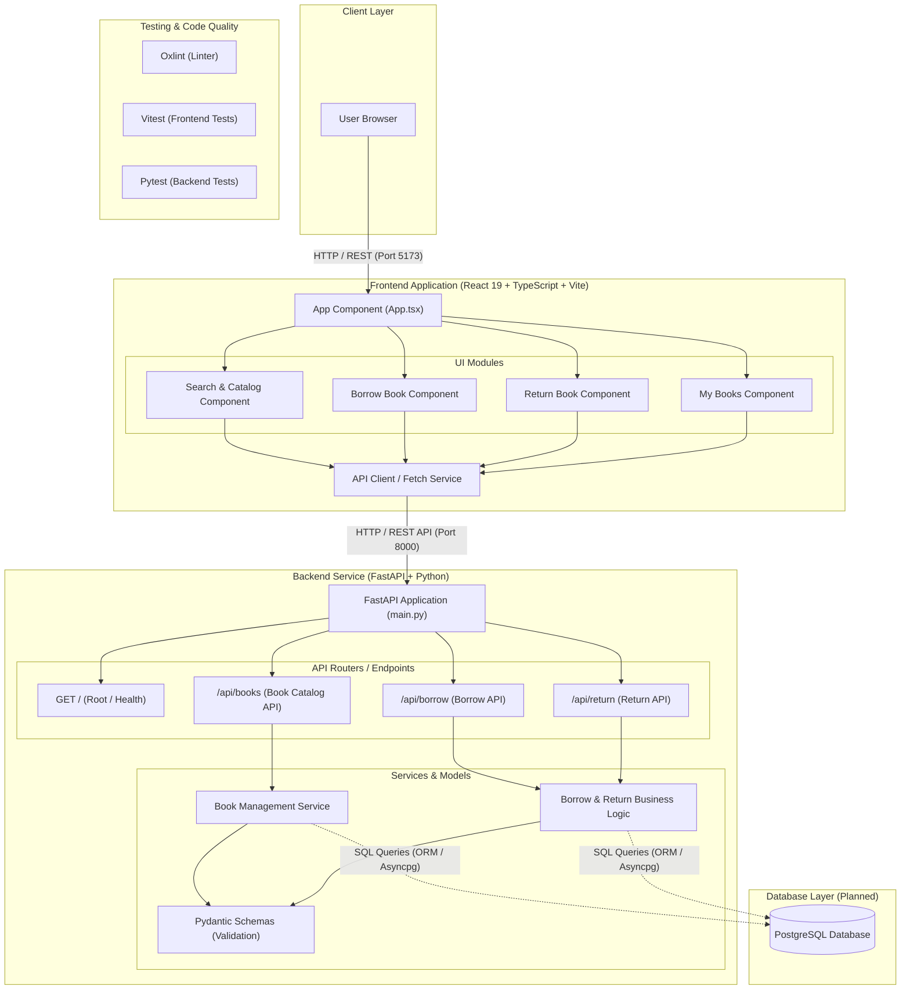

# 📐 Component Diagram - SDPX Torpai (ต่อไป)

เอกสารสรุปสถาปัตยกรรมและไดอะแกรมคอมโพเนนต์ (Component Diagram) ของระบบ **SDPX - Torpai (ระบบยืม-คืนหนังสือ)** ในรูปแบบ **Mermaid Diagram**

---

## 📊 Overview Component Diagram

---

## 🧩 คำอธิบายส่วนประกอบหลัก (Component Description)

### 1. **Client Layer**
- **User Browser**: ผู้ใช้งานเข้าถึงระบบผ่านเว็บเบราว์เซอร์เพื่อใช้งานระบบยืม-คืนหนังสือ

### 2. **Frontend Application (`/frontend`)**
- **App Component (`App.tsx`)**: คอมโพเนนต์หลักที่ควบคุม State และ Navigation ของแท็บหลัก (Search, Borrow, Return, My Books)
- **UI Modules**:
  - **Search & Catalog Component**: ระบบค้นหา Filter ตามหมวดหมู่ และแสดงรายการหนังสือ
  - **Borrow Book Component**: ฟอร์มรับรหัสนักศึกษาและ ISBN เพื่อทำรายการยืมหนังสือ
  - **Return Book Component**: ฟอร์มทำรายการคืนหนังสือ
  - **My Books Component**: แสดงรายการหนังสือที่ผู้ใช้กำลังยืมและกำหนดส่ง
- **API Client**: Service สำหรับยิง HTTP REST Requests ไปยัง FastAPI Backend

### 3. **Backend Service (`/backend`)**
- **FastAPI Application (`main.py`)**: เซิร์ฟเวอร์หลักรันด้วย Uvicorn ทำหน้าที่รับ-ส่ง HTTP REST Requests
- **API Routers / Endpoints**:
  - `GET /`: Health Check Endpoint
  - `/api/books`: ดึงข้อมูลและค้นหาหนังสือ
  - `/api/borrow`: จัดการธุรกรรมการยืมหนังสือ
  - `/api/return`: จัดการธุรกรรมการคืนหนังสือ
- **Services & Models**:
  - **Pydantic Schemas**: ตรวจสอบความถูกต้องของข้อมูล (Data Validation)
  - **Business Logic**: คำนวณวันกำหนดส่ง ตรวจสอบสถานะความพร้อมของหนังสือ และปรับปรุงสถานะ

### 4. **Database Layer (Planned)**
- **PostgreSQL**: ฐานข้อมูลเชิงสัมพันธ์สำหรับจัดเก็บข้อมูลหนังสือ ข้อมูลสมาชิก และประวัติการยืม-คืน

---

## 📄 การใช้งานและการอ่านไฟล์โดย AI
ไฟล์นี้ตั้งอยู่ที่ `docs/component-diagram.md` อยู่ภายใต้ระบบ Version Control (Git) ช่วยให้ทีมพัฒนาและ AI Agents สามารถทำความเข้าใจสถาปัตยกรรมของโปรเจกต์ได้อย่างรวดเร็ว
