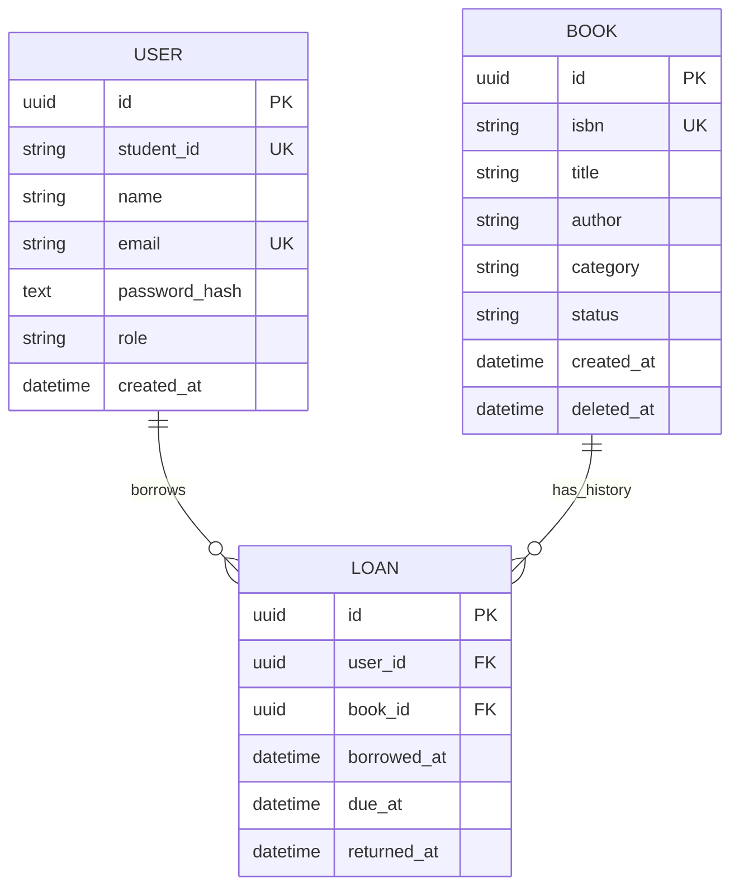

# UniLib ER Diagram

Only one loan with `returned_at IS NULL` may exist for a book. `student_id` is required for students and null for librarians. ISBN is stored without spaces or hyphens. `deleted_at` implements soft deletion so past loans keep their book information.
