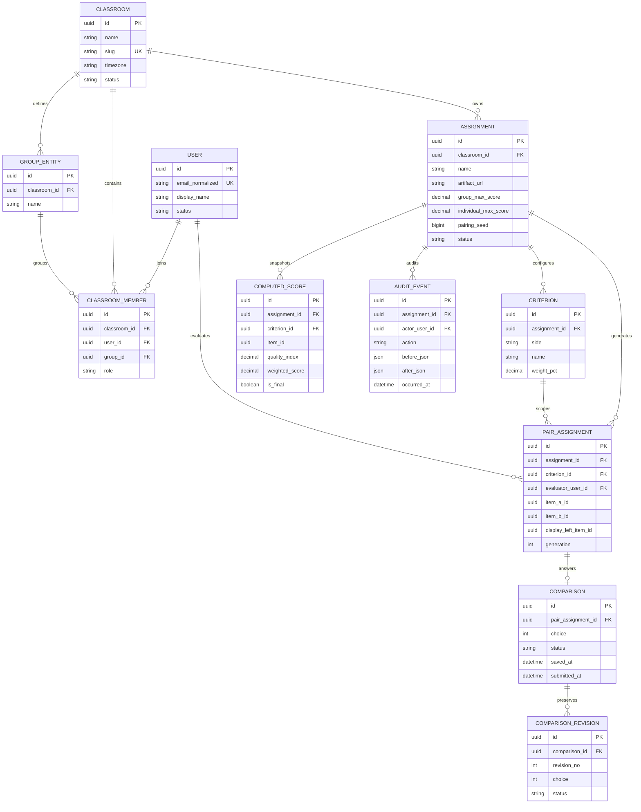

# PairEval Entity Relationship Diagram

Key constraints not expressible in the diagram are listed in the PRD and unit briefs: unordered pair uniqueness per evaluator/generation, submitted-only scoring, immutable final score snapshots, and append-only audit events.
