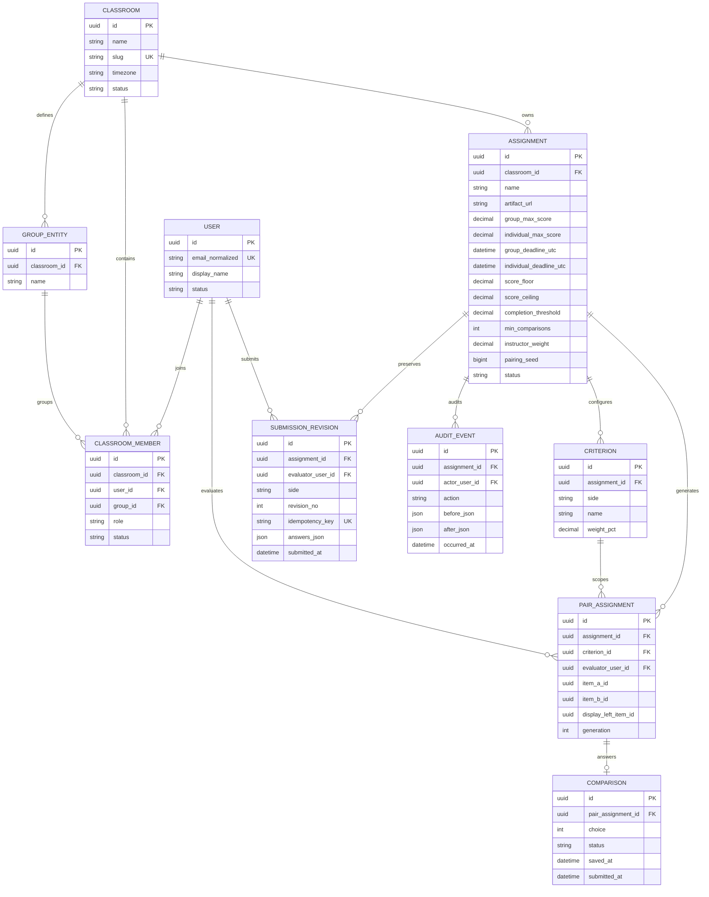

# PairEval Entity Relationship Diagram

```mermaid
erDiagram
    USER ||--o{ CLASSROOM_MEMBER : joins
    CLASSROOM ||--o{ CLASSROOM_MEMBER : contains
    CLASSROOM ||--o{ GROUP_ENTITY : defines
    GROUP_ENTITY ||--o{ CLASSROOM_MEMBER : groups
    CLASSROOM ||--o{ ASSIGNMENT : owns
    ASSIGNMENT ||--o{ CRITERION : configures
    ASSIGNMENT ||--o{ PAIR_ASSIGNMENT : generates
    CRITERION ||--o{ PAIR_ASSIGNMENT : scopes
    USER ||--o{ PAIR_ASSIGNMENT : evaluates
    PAIR_ASSIGNMENT ||--o| COMPARISON : answers
    ASSIGNMENT ||--o{ SUBMISSION_REVISION : preserves
    USER ||--o{ SUBMISSION_REVISION : submits
    ASSIGNMENT ||--o{ AUDIT_EVENT : audits

    USER {
        uuid id PK
        string email_normalized UK
        string display_name
        string status
    }
    CLASSROOM {
        uuid id PK
        string name
        string slug UK
        string timezone
        string status
    }
    CLASSROOM_MEMBER {
        uuid id PK
        uuid classroom_id FK
        uuid user_id FK
        uuid group_id FK
        string role
        string status
    }
    GROUP_ENTITY {
        uuid id PK
        uuid classroom_id FK
        string name
    }
    ASSIGNMENT {
        uuid id PK
        uuid classroom_id FK
        string name
        string artifact_url
        decimal group_max_score
        decimal individual_max_score
        datetime group_deadline_utc
        datetime individual_deadline_utc
        decimal score_floor
        decimal score_ceiling
        decimal completion_threshold
        int min_comparisons
        decimal instructor_weight
        bigint pairing_seed
        string status
    }
    CRITERION {
        uuid id PK
        uuid assignment_id FK
        string side
        string name
        decimal weight_pct
    }
    PAIR_ASSIGNMENT {
        uuid id PK
        uuid assignment_id FK
        uuid criterion_id FK
        uuid evaluator_user_id FK
        uuid item_a_id
        uuid item_b_id
        uuid display_left_item_id
        int generation
    }
    COMPARISON {
        uuid id PK
        uuid pair_assignment_id FK
        int choice
        string status
        datetime saved_at
        datetime submitted_at
    }
    SUBMISSION_REVISION {
        uuid id PK
        uuid assignment_id FK
        uuid evaluator_user_id FK
        string side
        int revision_no
        string idempotency_key UK
        json answers_json
        datetime submitted_at
    }
    AUDIT_EVENT {
        uuid id PK
        uuid assignment_id FK
        uuid actor_user_id FK
        string action
        json before_json
        json after_json
        datetime occurred_at
    }
```

`PAIR_ASSIGNMENT.item_*` resolves to `GROUP_ENTITY` for Group criteria and `USER` for Individual criteria.
Mutable `COMPARISON` rows are current drafts; scoring reads only the latest immutable
`SUBMISSION_REVISION.answers_json`. Final score snapshots remain M3.
