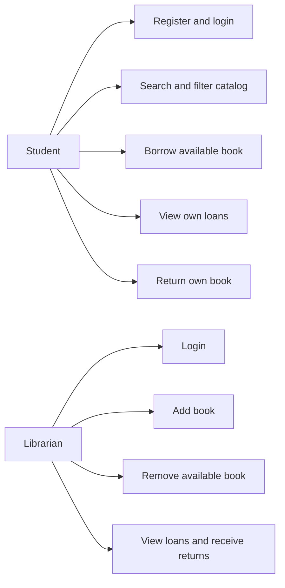
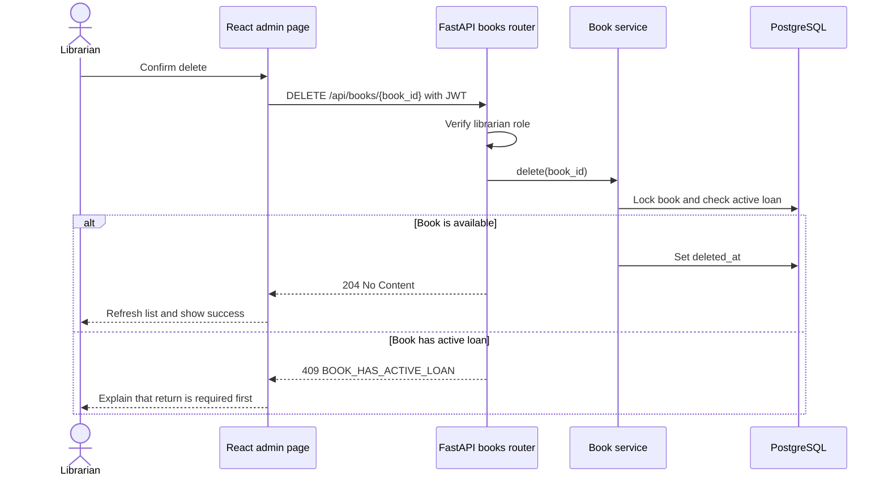

# UniLib Requirements and Traceability (WS2)

## Actors and use cases

## [US-10: Librarian removes a book](https://github.com/KNIGHTKRUBPOM/sdpx-torpai/issues/19)

As a librarian, I want to remove an unused book from the catalog, so that students only see books currently managed by the library.

### Acceptance Criteria

- Given an available book, when a librarian confirms deletion, then the API returns `204` and the book disappears from the catalog.
- Given a book with an active loan, when a librarian tries to delete it, then the API returns `409 BOOK_HAS_ACTIVE_LOAN` and keeps the book.
- Given a student account, when it calls the delete endpoint, then the API returns `403 LIBRARIAN_REQUIRED`.
- Given an unknown or previously deleted book ID, when a librarian deletes it, then the API returns `404 BOOK_NOT_FOUND`.
- Given a book with returned-loan history, when a librarian deletes it, then the catalog hides the book while the loan history remains readable.

### Definition of Done

- Behavior passes unit, API integration and librarian E2E tests.
- OpenAPI documents success, authentication and error responses.
- Architecture, ERD and unit brief describe soft deletion.
- Feature passes review and the staging deployment remains usable.

## Delete-book sequence

## Story to contract traceability

| Story | User outcome | API operation | Automated evidence |
|---|---|---|---|
| US-01 | Register student | `POST /api/auth/register` | Backend API and student E2E |
| US-02 | Login and logout | `POST /api/auth/login`, `GET /api/auth/me` | Backend API and frontend component |
| US-03 | Search catalog | `GET /api/books?q=` | Book-service unit test |
| US-04 | Filter catalog | `GET /api/books?category=&status=` | Catalog UI and API |
| US-05 | Add book | `POST /api/books` | Backend API and librarian E2E |
| US-06 | Borrow book | `POST /api/loans` | Service, API and student E2E |
| US-07 | Return book | `POST /api/loans/{loan_id}/return` | Service, API and student E2E |
| US-08 | View own loans | `GET /api/loans/me` | Backend API and student E2E |
| US-09 | Manage all loans | `GET /api/loans` | Backend authorization and librarian UI |
| US-10 | Remove available book | `DELETE /api/books/{book_id}` | Service, API and librarian E2E |

## AI judgement to defend

- Rejected hard delete because it would either break foreign keys or erase loan history.
- Rejected student deletion because catalog management belongs to the librarian role.
- Deferred deleting actively borrowed books because the inventory would contradict the open loan.
